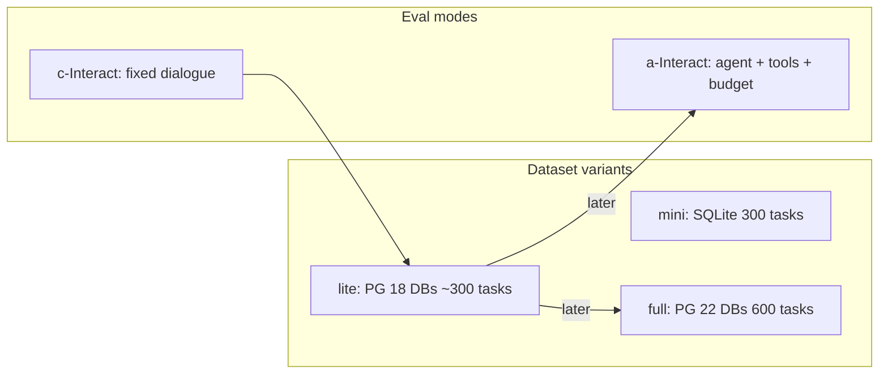

# Bird-Interact: Mode, Dataset, and Ingestion Decisions

## Context in this repo

[`ontology-sql-eval`](README.md) today is **single-turn only** ([`eval_chatbot.py`](ontology_sql_eval/retrieval/eval_chatbot.py) calls `get_agent_response` once with empty `path_state`). Existing BIRD Mini-Dev (11 SQLite DBs) is **unrelated** to Bird-Interact’s LiveSQLBench-derived DBs. Your GSF Docker (Neo4j + pgvector) is **not** the Bird-Interact DB environment — Bird ships separate Postgres containers (`bird_interact_postgresql` / `_full`).

---

## 1. c-Interact vs a-Interact — start with c-Interact

| | **c-Interact** | **a-Interact** |
|---|---|---|
| Role of system | Passive chat assistant | Active agent (ReAct) |
| Workflow | Fixed: clarify → SQL → 1 debug → follow-up → 1 debug | Dynamic: agent chooses among ~9 tools |
| Budget | Clarification turn limit (`#ambiguities + patience`) | Action costs in *bird-coin*s |
| What you must build | Multi-turn chat loop + user simulator + test-case scoring | All of that **plus** tool APIs, budget accounting, agent scaffold |
| Official code | [`bird_interact_conv/`](https://github.com/bird-bench/BIRD-Interact/tree/main/bird_interact_conv) | [`bird_interact_agent/`](https://github.com/bird-bench/BIRD-Interact/tree/main/bird_interact_agent) |

**Difficulty:** a-Interact is **significantly harder**. It needs an action space (execute SQL, read metadata/HKB, ask user, submit, etc.), cost tracking, and agent planning. c-Interact is a **fixed protocol** that wraps a chat model — much closer to extending your current `get_agent_response` loop.

**Recommendation:** Implement **c-Interact first**. Add a-Interact later only if you want to measure agentic tool use (GSF as an embodied agent), not as the first integration milestone.

---

## 2. Which dataset version — start with bird-interact-lite; skip mini as primary; defer full

| Variant | Backend | Scale | Notes |
|---|---|---|---|
| **mini-interact** | SQLite | 300 tasks | No Bird DB Docker; BI-only (CRUD later); tasks transformed from lite+full |
| **bird-interact-lite** | PostgreSQL | ~300 tasks, **18 DBs**, ~175 tables | Official “quick experimentation” set |
| **bird-interact-full** | PostgreSQL | 600 tasks, **22 DBs**, ~244 tables | Richer/noisier schemas, N:M relations — **not the same DBs as lite** |

Having Docker + a working model does **not** make mini obsolete for *interaction-loop* prototyping, but it **does** mean you should not treat mini as the production target:

- You already run Postgres source DBs (WWI) and GSF connectors for Postgres.
- Official scoring / leaderboard paths are Postgres (lite → full).
- mini omits full CRUD and uses different SQLite artifacts — ingesting it does not transfer to lite/full graphs.

**Recommendation:**

1. **Primary:** `bird-interact-lite` + Bird’s `bird_interact_postgresql` container (or load their lite dumps into local Postgres).
2. **Skip mini** as the main path (optional later only if you want a SQLite smoke test of the dialogue loop).
3. **Defer full** until lite c-Interact runs end-to-end — full needs a second DB env and ~2× semantic work on different schemas.

---

## 3. Ingest / semantic now? — Yes for **lite only**

**Are the three databases identical?** No.

- **lite vs full:** Separate dumps and containers. Lite = 18 DBs; full = 22 DBs with more complex relationships and noisier data. Schemas are **not** interchangeable; ingesting one does not cover the other.
- **mini:** SQLite ports of tasks drawn from both lite and full — a **third** backend, not a drop-in of either Postgres set.
- **Existing `datasets/bird` Mini-Dev:** Unrelated 11 SQLite DBs — do not reuse those graphs.

**Can you start ingestion immediately?** Yes for **lite**, and it is the right parallelization:

- Ingest + semantic only need **schema connectivity** (`CONNECTION_STRINGS` per DB), not GT SQL / test cases.
- GT + test cases (email `bird.bench25@gmail.com` with `[bird-interact-lite GT&Test Cases]`) are required for **scoring**, not for Neo4j/pgvector build — request those in parallel.
- Expect **hours** for 18 DBs of semantic compilation (LLM SqlAttribute / taxonomy passes), similar to multi-DB BIRD but larger schemas (~2286 columns total).

**Do not** kick off mini or full ingestion yet — wasted graph/embedding work if lite is the first eval target.

**Practical ingest path:**

1. `docker compose up` Bird-Interact `bird_interact_postgresql` (from [BIRD-Interact/env](https://github.com/bird-bench/BIRD-Interact/tree/main/env)); verify with their `check_db_metadata.py` (expect 18 DBs).
2. Point `CONNECTION_STRINGS` at each of the 18 DBs (same multi-DB pattern as BIRD Mini-Dev).
3. Run ingest → semantic per `database_name`, keyed separately from WWI/BIRD Mini-Dev.
4. Optionally convert Bird metafiles (column meanings / HKB) into `metadata.json` / enrichment later — not blocking first ingest.

---

## Suggested phased plan (after you approve)

| Phase | Work | Can start now? |
|---|---|---|
| **A** | Spin up lite Postgres; ingest + semantic all 18 DBs | **Yes** |
| **A′** | Email for lite GT & test cases; combine into `bird_interact_data.jsonl` | **Yes** (parallel) |
| **B** | c-Interact eval driver: fixed clarify/SQL/debug/follow-up loop calling GSF; user simulator (reuse Bird’s or thin wrapper); test-case scoring + cleanup SQL | After A′ for full scoring; can stub loop earlier |
| **C** | Wire `main.py` / dataset folder / seed script for lite | With B |
| **D** | a-Interact + full dataset | Only after B works on lite |

**Hardest gap vs current code:** multi-turn state, user simulator, CRUD + `preprocess_sql` / `clean_up_sql` / `test_cases`, and phase-2 gated on phase-1 success — none of this exists in [`eval_chatbot.py`](ontology_sql_eval/retrieval/eval_chatbot.py). Ingestion reuse is the easy part.
