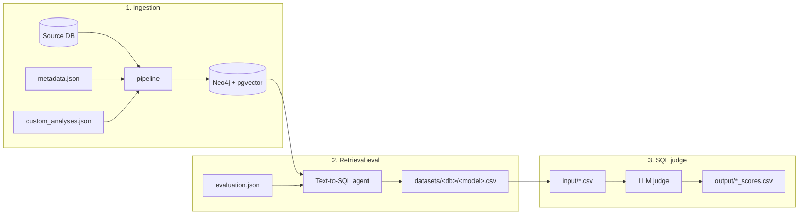

# Ontology SQL Eeval

A Text-to-SQL evaluation toolkit for benchmarking a text-to-SQL agent against a
dataset and scoring the results. It bundles three workflows in one project:

1. **ingestion** — extract a source database's schema into the pgvector + Neo4j
   stores, compile the semantic layer, and enrich the graph with metadata and
   custom analyses.
2. **retrieval eval** — run the text-to-SQL agent against an evaluation set and
   score its generated SQL and answers deterministically.
3. **sql judge** — a standalone, LLM-powered re-scorer for Text-to-SQL
   evaluation CSVs (works on its own, no database or GSF/NeMo install required).

The typical lifecycle is **ingest → eval → judge**: you ingest a database so the
agent can retrieve its schema, run an evaluation to produce a results CSV, then
optionally re-score that CSV with the LLM judge.



The ingestion and retrieval-eval workflows reuse the `gsf` (from the sibling
`../GSF` checkout) and `nemo_retriever` (installed from GitHub) code rather than
re-implementing it. The judge is fully self-contained.

## Layout

```
ontology_sql_eval/          single namespace package
  judge/                    standalone LLM scorer (no GSF dependency)
    config.py               resolves JUDGE_* settings from .env
    scorer.py               per-row LLM scoring call
    runner.py               batch/directory orchestration
    models.py               Pydantic score model + scoring prompt
    main.py                 CLI entry point (ontology-sql-eval)
  ingestion/                GSF-backed ingestion pipeline
    pipeline.py             source DB -> pgvector ingest (calls enrich_graph)
    enrich_graph.py         graph metadata + custom-analysis enrichment
    mock_ingest.py          in-memory 4-table demo ingest (mock_shop)
  retrieval/                GSF-backed retrieval eval
    eval_chatbot.py         retrieval eval driver
    scoring.py              SQL/answer scoring helpers
scripts/
  seed_postgres.py          seed a local Postgres from datasets/<db>/{ddl,data}
datasets/
  <database_name>/          evaluation.json, metadata.json, custom_analyses.json
    ddl/                    seed DDL (schemas, sequences, tables, indexes, fkeys, views)
    data/                   seed CSV data (COPYed into the tables)
input/                      judge input CSVs to score (created on demand, gitignored)
output/                     judge scored CSVs (<name>_scores.csv; gitignored)
```

## Prerequisites

Different workflows have different requirements. The **judge** is the lightest —
it needs nothing beyond this repo and an LLM API key.

| Requirement                                                | Ingestion  | Retrieval eval | Judge |
| ---------------------------------------------------------- | :--------: | :------------: | :---: |
| [uv](https://docs.astral.sh/uv/) + Python 3.12 (3.12–3.13) |    yes     |      yes       |  yes  |
| Sibling repo `../GSF` checkout                             |    yes     |      yes       |  no   |
| GitHub access to `NVIDIA/NeMo-Retriever`                   |    yes     |      yes       |  no   |
| Neo4j + Postgres (pgvector) services                       |    yes     |      yes       |  no   |
| Reachable source database                                  |    yes     |      yes       |  no   |
| LLM API key                                                | embed only |      yes       |  yes  |

The two dependencies are provided differently:

- `../GSF` — provides the `gsf` package. Check it out next to this repo; it is
  imported via `PYTHONPATH` (not installed — see below).
- `nemo-retriever` (`https://github.com/NVIDIA/NeMo-Retriever.git`) — provides
  `nemo_retriever`, installed from GitHub by `uv sync` (see `[tool.uv.sources]`
  in [pyproject.toml](pyproject.toml)).

For ingestion and retrieval eval you also need live **Neo4j** and **Postgres
(pgvector)** services, plus a reachable source DB. The easiest way to start the
stores is GSF's `docker-compose.yml`:

```bash
cd ../GSF && docker compose up -d
```

## Setup

```bash
uv sync                # creates the unified .venv (Python 3.12), pulling nemo_retriever from GitHub
cp .env.example .env   # then fill in your values
```

GSF is `package = false`, so `gsf` is not installed into the venv — it imports
only when `../GSF` is on `PYTHONPATH`. The VS Code launch configs set this
automatically. For command-line runs of the ingestion / eval scripts, prefix the
command with `PYTHONPATH=../GSF` (the judge does not need it).

## Configuration

All settings are read from `.env` (see [.env.example](.env.example) for the full
list). Variables are grouped by the workflow that uses them:

| Variable                                              | Used by       | Description                                                           |
| ----------------------------------------------------- | ------------- | --------------------------------------------------------------------- |
| `NVIDIA_API_KEY`, `BASE_URL`, `MODEL_NAME`            | agent (eval)  | LLM that the text-to-SQL agent generates with.                        |
| `JUDGE_API_KEY`, `JUDGE_BASE_URL`, `JUDGE_MODEL_NAME` | judge         | LLM that the judge scores with (falls back to the shared vars above). |
| `EMBED_API_KEY`, `EMBED_ENDPOINT`, `EMBED_MODEL`      | ingest + eval | Embedding endpoint (must be identical for ingest and query).          |
| `NEO4J_URI`, `NEO4J_USERNAME`, `NEO4J_PASSWORD`       | ingest + eval | Graph store connection.                                               |
| `POSTGRES_*`                                          | ingest + eval | pgvector store connection.                                            |
| `CONNECTION_STRINGS`                                  | ingest + eval | Source DB to extract schema from / execute SQL against.               |

Which variables each workflow strictly needs:

| Variable group                               | Ingestion | Retrieval eval |         Judge          |
| -------------------------------------------- | :-------: | :------------: | :--------------------: |
| `CONNECTION_STRINGS`                         |    yes    |      yes       |                        |
| `EMBED_*`                                    |    yes    |      yes       |                        |
| `NEO4J_*`                                    |    yes    |      yes       |                        |
| `POSTGRES_*`                                 |    yes    |      yes       |                        |
| `NVIDIA_API_KEY` / `BASE_URL` / `MODEL_NAME` | mock only |  yes (agent)   | fallback for `JUDGE_*` |
| `JUDGE_*`                                    |           |                |          yes           |

## Datasets

Each dataset lives in its own folder under `datasets/<database_name>/`. The
folder name is the database name and is used to derive default file paths.

```
datasets/<database_name>/
  evaluation.json        # eval questions + expected SQL (retrieval-eval input)
  metadata.json          # table/column descriptions (ingestion enrichment; optional)
  custom_analyses.json   # named example analyses (ingestion enrichment; optional)
  <model>.csv            # generated by retrieval eval (output)
```

The repo ships with `wideworldimporters` as a public worked example; the
examples below use it throughout.

### `evaluation.json`

A JSON **array** of question objects. Fields consumed by the retrieval eval:

| Field         | Required | Purpose                                                                |
| ------------- | :------: | ---------------------------------------------------------------------- |
| `question_id` |    no    | Identifier for logging and the CSV row. Falls back to the array index. |
| `question`    |   yes    | Natural-language question sent to the agent.                           |
| `SQL`         |   yes    | Expected (ground-truth) SQL.                                           |
| `answer_raw`  |    no    | Expected user-facing answer, compared against the agent's DB result.   |
| `difficulty`  |    no    | Passed through to the output CSV.                                      |

```json
[
  {
    "question_id": 3,
    "db_id": "WIDEWORLDIMPORTERS",
    "question": "calculate the customer count by state province name",
    "evidence": "",
    "SQL": "select sp.stateprovincename as state_province_name, count(c.customerid) as customer_count from sales.customers c join application.cities ct on c.deliverycityid = ct.cityid join application.stateprovinces sp on ct.stateprovinceid = sp.stateprovinceid group by sp.stateprovincename order by state_province_name desc;",
    "difficulty": "",
    "answer_raw": "",
    "answer": ""
  }
]
```

### `metadata.json`

An object keyed by table name, used only during ingestion to stamp descriptions
and sample values onto the Neo4j graph. Optional — enrichment is skipped if the
file is missing.

```json
{
  "sales.customers": {
    "description": "One row per customer account.",
    "columns": [
      {
        "name": "customername",
        "description": "Display name of the customer.",
        "value_examples": ["Tailspin Toys", "Wingtip Toys"]
      }
    ]
  }
}
```

### `custom_analyses.json`

An array of named example analyses. During ingestion each analysis is parsed
against the ingested schema, added to the graph as a `CustomAnalysis` node, and
embedded into the semantic vector store. Optional.

```json
[
  {
    "name": "Americas Region Countries",
    "description": "Countries that belong to the Americas region.",
    "sql": "select region from application.countries where region like '%Americas%'"
  }
]
```

## Usage

### 0. Seed the local source DB (optional)

Ingestion and retrieval eval need a reachable source database. If you don't
already have one, `scripts/seed_postgres.py` loads a pre-generated schema + data
into your local Postgres. Seed artifacts live alongside the eval artifacts under
`datasets/<database_name>/`, in a `ddl/` folder and a `data/` folder of CSVs. The
bundled example is `wideworldimporters`:

```bash
uv run python scripts/seed_postgres.py --database-name wideworldimporters --drop
```

This creates the database (using `POSTGRES_*` from `.env`, with
`POSTGRES_DATABASE` as the admin connection), applies the DDL, `COPY`s the CSVs,
then adds foreign keys and views. Afterwards, point `CONNECTION_STRINGS` at the
seeded DB (see [Configuration](#configuration)).

Flags:

- `--database-name <name>` — selects `datasets/<name>/` and names the target DB
  (default `wideworldimporters`).
- `--drop` — drop and recreate the database first (uses `WITH (FORCE)` to
  terminate any lingering sessions).
- `--refresh-collation` — run `ALTER DATABASE ... REFRESH COLLATION VERSION` on
  `template1` and the admin DB before creating. Use this if Postgres reports a
  `collation version mismatch` (common after an OS `libc`/ICU change, e.g. when
  the pgvector container image is updated).
- `--log-level {DEBUG,INFO,WARNING,ERROR}` — logging verbosity (default `INFO`).

### 1. Ingestion

Populates the Neo4j graph and pgvector stores from a source database so the
text-to-SQL agent has schema and semantic context to retrieve. Set
`CONNECTION_STRINGS` to point at the source DB (metadata and custom analyses are
read from `datasets/<database_name>/`, where `<database_name>` comes from the
connector), then run the pipeline.

```bash
PYTHONPATH=../GSF uv run python -m ontology_sql_eval.ingestion.pipeline                 # extract + embed + enrich graph
PYTHONPATH=../GSF uv run python -m gsf.semantic --database-name <database_name>  # compile semantic layer
```

`run_ingest()` performs, in order:

1. Create a connector from `CONNECTION_STRINGS` (the first entry) and derive the
   database name from it.
2. Extract the tabular schema (tables/columns) into the Neo4j graph.
3. `apply_metadata()` — stamp `metadata.json` descriptions and sample values
   onto the graph nodes (skipped if the file is missing).
4. Embed the schema rows via the embedding endpoint and write them to the
   pgvector **data** store.
5. `add_custom_analyses()` — parse `custom_analyses.json`, create
   `CustomAnalysis` nodes, and embed them into the pgvector **semantic** store.

Data destinations:

| Destination                      | Content                                                                                        |
| -------------------------------- | ---------------------------------------------------------------------------------------------- |
| Neo4j (`NEO4J_*`)                | Schema graph (Database → Schema → Table → Column), metadata properties, custom-analysis nodes. |
| Postgres pgvector (`POSTGRES_*`) | Schema embeddings (data store) + custom-analysis embeddings (semantic store).                  |

For a quick, DB-free smoke test of the embed pipeline (uses an in-memory
4-table `mock_shop` schema; needs `NVIDIA_API_KEY` for embeddings):

```bash
PYTHONPATH=../GSF uv run python -m ontology_sql_eval.ingestion.mock_ingest
```

### 2. Retrieval eval

Runs the text-to-SQL agent against `datasets/<database_name>/evaluation.json`
and scores each question deterministically: the expected and returned SQL are
both executed against the live source DB and their result sets compared, and the
returned answer is compared against `answer_raw`.

```bash
PYTHONPATH=../GSF uv run python -m ontology_sql_eval.retrieval.eval_chatbot --database-name <database_name>
```

CLI flags:

| Flag              | Default | Purpose                                                                                   |
| ----------------- | ------- | ----------------------------------------------------------------------------------------- |
| `--database-name` | —       | Derives input `datasets/<name>/evaluation.json` and output `datasets/<name>/<model>.csv`. |
| `--input PATH`    | derived | Override the input JSON path.                                                             |
| `--output PATH`   | derived | Override the output CSV path.                                                             |
| `--single`        | off     | Run one example query (`SINGLE_QUERY` in the script) and print the result.                |

The output CSV (`datasets/<database_name>/<model>.csv`, where `<model>` is the
last segment of `MODEL_NAME`) has these columns:

```
row_index, question_id, difficulty, question, expected_sql, returned_sql,
sql_text_similarity, sql_exec_match, expected_sql_error, returned_sql_error,
expected_sql_result, expected_answer_raw, returned_answer,
answer_text_similarity, answer_numbers_match, runtime_seconds, error
```

These column names are compatible with the judge's input contract (`question`,
`expected_sql`, `returned_sql`, `returned_answer`), so the CSV can be re-scored
directly.

### 3. SQL judge (standalone)

Re-scores evaluation CSVs with an LLM that rates each row's SQL on logic,
semantics, and similarity to the ground truth. This workflow is fully
self-contained — no GSF/NeMo install, database, or vector stores required, only
a judge LLM API key.

Drop one or more CSV files into `input/`. Each file must contain `question`,
`expected_sql`, and `returned_sql` columns (and optionally `returned_answer`,
used as a result preview). Rows with an empty `returned_sql` are skipped. Scored
CSVs are written to `output/<name>_scores.csv`. Both folders are created on
demand (relative to the current directory) and are not tracked in git.

```bash
uv run ontology-sql-eval     # or: uv run python main.py
```

Options: `--input-dir` (default `input`), `--output-dir` (default `output`),
`--workers` (default `1`).

The judge preserves all original columns and appends:

```
llm_logic_match, llm_semantic_match, llm_final_weighted_score,
llm_sql_vs_ground_truth, llm_is_valid_sql, llm_is_sql_returns_data,
llm_logic_issues
```

The scoring model is configured via `JUDGE_MODEL_NAME` / `JUDGE_BASE_URL` /
`JUDGE_API_KEY`, each falling back to the shared `MODEL_NAME` / `BASE_URL` /
`NVIDIA_API_KEY` when unset.

## End-to-end example

Using the bundled `wideworldimporters` dataset (assumes the stores are up and
`.env` is filled in).

**One shot** — `main.py` runs all four stages (ingest -> semantic compile ->
eval -> judge) in sequence, writing `datasets/<db>/<model>_scores.csv`:

```bash
PYTHONPATH=../GSF uv run python main.py --database-name wideworldimporters
```

Individual stages can be skipped with `--skip-ingest`, `--skip-semantic`,
`--skip-eval`, `--skip-judge` (e.g. to re-judge an existing eval CSV:
`--skip-ingest --skip-semantic --skip-eval`).

**Manual** — the equivalent step-by-step invocation:

```bash
# 1. Ingest the source DB schema into Neo4j + pgvector, then compile semantics.
PYTHONPATH=../GSF uv run python -m ontology_sql_eval.ingestion.pipeline
PYTHONPATH=../GSF uv run python -m gsf.semantic --database-name wideworldimporters

# 2. Run the agent against the eval set -> datasets/wideworldimporters/<model>.csv
PYTHONPATH=../GSF uv run python -m ontology_sql_eval.retrieval.eval_chatbot \
    --database-name wideworldimporters

# 3. Re-score the eval CSV with the LLM judge.
mkdir -p input
cp datasets/wideworldimporters/*.csv input/
uv run ontology-sql-eval      # writes output/<name>_scores.csv
```

## Development

VS Code launch configurations for all of the above (Run full pipeline, Judge,
Ingest, Semantic compile, Eval, Eval single-query) are provided in
[.vscode/launch.json](.vscode/launch.json); they set `PYTHONPATH=../GSF` and load
`.env` automatically. The type-checker path for `../GSF` is configured in
[pyrightconfig.json](pyrightconfig.json).

## License and security

This project is licensed under **Apache-2.0** (see the SPDX headers in the
source files and the `license` field in [pyproject.toml](pyproject.toml)).

To report a security vulnerability, follow the process in [SECURITY.md](SECURITY.md).
